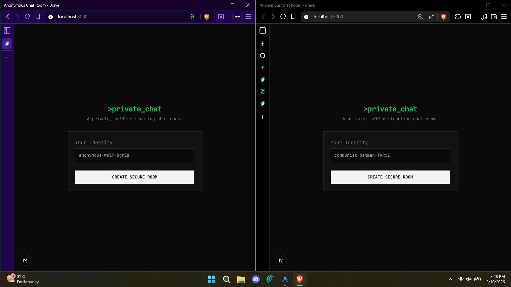
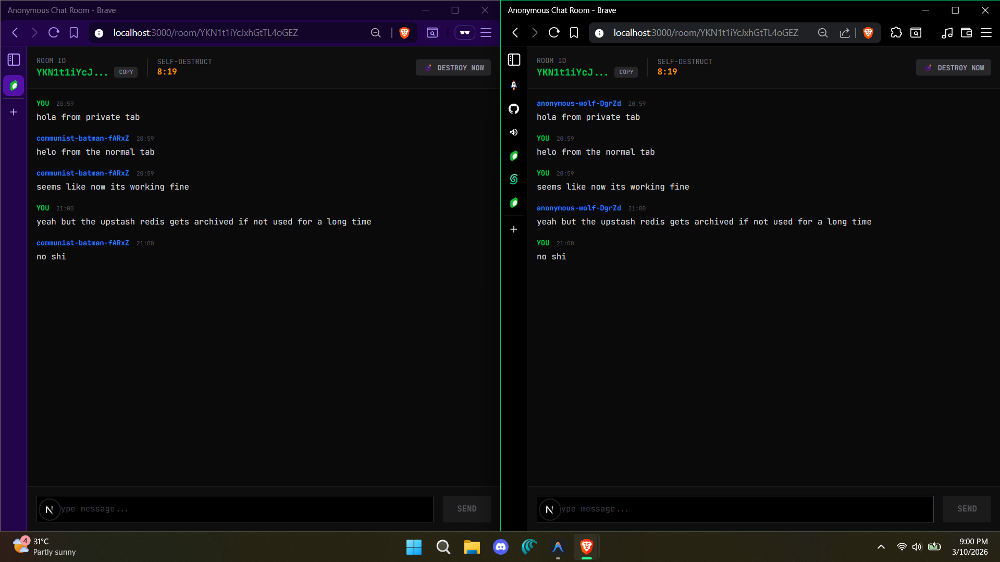
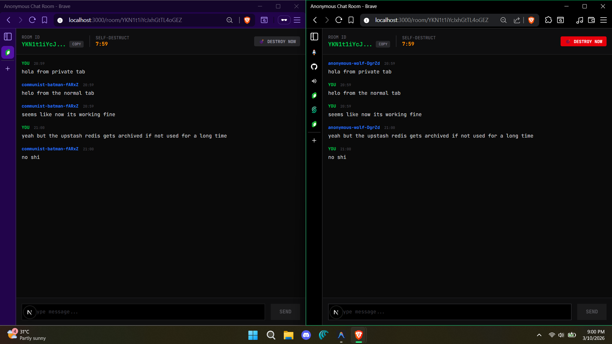
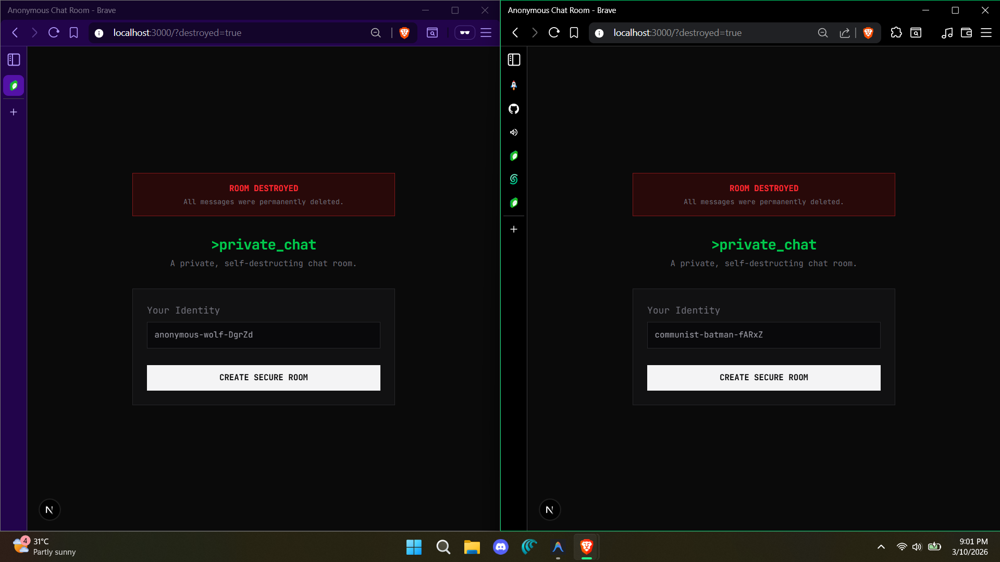

<div align="center">

# 💬 Realtime Chat

### Instant Messaging with a Scalable, Type-Safe Architecture

A modern real-time chat application built with **Next.js App Router**, a type-safe **Elysia.js** backend, and **Upstash** for serverless pub/sub and storage.

[](https://anonymous-room-chat.vercel.app/)
[](https://nextjs.org/)
[](https://tailwindcss.com/)
[](https://upstash.com/)
[](https://www.typescriptlang.org/)

</div>

---

## ✨ Features

| Feature | Description |
|---|---|
| ⚡ **Real-Time Messaging** | Instant message delivery powered by **Upstash Realtime** pub/sub |
| 🏠 **Chat Rooms** | Create and join named chat rooms via unique room IDs |
| 🙋 **Anonymous Usernames** | Auto-generated persistent usernames stored in the browser |
| 🔗 **Type-Safe API** | End-to-end type safety via **Elysia.js** + **Eden** client |
| 🗃️ **Message History** | Recent messages fetched from **Upstash Redis** on room join |
| ⚙️ **Server-State Management** | Efficient data fetching and caching via **TanStack Query** |
| 📱 **Responsive Design** | Fully responsive UI built with **TailwindCSS v4** |
| 💣 **Self-Destructing Rooms** | Rooms expire via a countdown timer — all messages permanently deleted on destroy |

---

## 🖼️ Screenshots

**Homepage — Create a Secure Room**


**Chat Room — Real-Time Messaging**


**Self-Destruct Countdown**


**Room Destroyed — Messages Permanently Deleted**


---

## 🛠️ Tech Stack

| Technology | Purpose |
|---|---|
| [Next.js 16](https://nextjs.org/) | Full-stack React framework with App Router |
| [React 19](https://react.dev/) | UI library |
| [Elysia.js](https://elysiajs.com/) | Fast, type-safe backend API |
| [Eden](https://elysiajs.com/eden/overview) | Type-safe Elysia client |
| [Upstash Redis](https://upstash.com/) | Serverless key-value store for message history |
| [Upstash Realtime](https://upstash.com/) | Serverless pub/sub for live message delivery |
| [TanStack Query](https://tanstack.com/query/) | Server-state management & caching |
| [TailwindCSS v4](https://tailwindcss.com/) | Utility-first CSS styling |
| [date-fns](https://date-fns.org/) | Date formatting utilities |
| [Zod](https://zod.dev/) | Schema validation |
| [TypeScript](https://www.typescriptlang.org/) | Type safety |

---

## 🚀 Getting Started

### Prerequisites

- [Node.js](https://nodejs.org/) v20+
- [Bun](https://bun.sh/) (recommended) or npm
- An [Upstash](https://upstash.com/) account (for Redis & Realtime)

### Installation

```bash
# Clone the repository
git clone https://github.com/your-username/realtime-chat.git
cd realtime-chat/realtime_chat

# Install dependencies
bun install
```

### Environment Variables

Create a `.env` file in the root directory:

```env
UPSTASH_REDIS_REST_URL=<your-upstash-redis-url>
UPSTASH_REDIS_REST_TOKEN=<your-upstash-redis-token>
UPSTASH_REALTIME_REST_URL=<your-upstash-realtime-url>
UPSTASH_REALTIME_REST_TOKEN=<your-upstash-realtime-token>
```

### Development

```bash
bun run dev
```

The app will be available at `http://localhost:3000`.

### Production Build

```bash
bun run build
bun run start
```

---

## 📁 Project Structure

```
realtime_chat/
├── src/
│   ├── app/
│   │   ├── api/
│   │   │   ├── [[...slugs]]/      # Elysia.js API routes (catch-all)
│   │   │   └── realtime/          # Upstash Realtime webhook endpoint
│   │   ├── room/
│   │   │   └── [roomID]/          # Dynamic chat room page
│   │   ├── layout.tsx             # App shell & TanStack Query provider
│   │   ├── page.tsx               # Landing page (create/join room)
│   │   └── globals.css            # Global styles
│   ├── components/
│   │   └── providers.tsx          # TanStack Query client provider
│   ├── hooks/
│   │   └── use-username.ts        # Hook for persistent anonymous username
│   ├── lib/
│   │   ├── client.ts              # Eden type-safe API client
│   │   ├── realtime-client.ts     # Upstash Realtime client setup
│   │   ├── realtime.ts            # Realtime pub/sub logic
│   │   └── redis.ts               # Upstash Redis client setup
│   └── proxy.ts                   # API proxy configuration
├── public/                        # Static assets
├── next.config.ts                 # Next.js configuration
├── tsconfig.json                  # TypeScript configuration
└── package.json
```

---

## 🔄 How It Works

```
┌──────────────┐     ┌──────────────┐     ┌──────────────────┐     ┌──────────────┐
│  Join / Create│────▶│  Fetch History│────▶│  Send Message    │────▶│  Broadcast   │
│  Chat Room    │     │  from Redis  │     │  via Elysia API  │     │  via Realtime│
└──────────────┘     └──────────────┘     └──────────────────┘     └──────────────┘
```

1. **Join** — Enter a room ID (or create a new one) from the landing page
2. **History** — Recent messages are fetched from Upstash Redis via TanStack Query
3. **Send** — Messages are posted to the Elysia.js API, persisted to Redis, and published to the Realtime channel
4. **Broadcast** — All connected clients receive the new message instantly via Upstash Realtime pub/sub

---

## 📄 License

This project is open source and available under the [MIT License](LICENSE).

---

<div align="center">

Built with ❤️ using Next.js, Elysia.js & Upstash

</div>